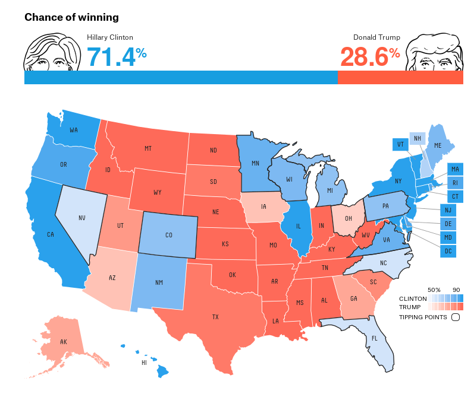

```{r setup, include=FALSE}
knitr::opts_chunk$set(echo = TRUE)
```

```{r echo=FALSE}
nx <- 20
x <- rep(seq(0, 1, length=nx), times=nx)
y <- rep(seq(0, 1, length=nx), each=nx)
```

## Spatial statistics
The basic insight of spatial statistics is that nearby locations are generally more alike than distant ones. Spatial statistical models are those that incorporate this idea. Today we're going to look at a small sample of what people do with spatial statistics.

Now if observations made at different locations are related to each other, they are not independent. In terms of statistical models, the multivariate Gaussian (or normal) distribution is well-understood but it is extremely difficult to create multivariate versions of other distributions. So almost always, if spatial data cannot be treated as multivariate normal then it is transformed to a scale where it can be.

Here, I've plotted two Gaussian random fields: one is independent, and the other has spatial association. You can see that there is clustering on the right but not on the left.

```{r spatial-err, echo=FALSE, fig.width=11, fig.height=6}
# Generate the independent random field
z1 <- matrix(rnorm(nx**2), nx, nx)

# Generate the spatial random field
d <- sqrt(outer(x, x, '-')^2 + outer(y, y, '-')^2)
s2 <- 1
range <- 0.2
expmod <- s2 * exp(-d / range)
L <- t(chol(expmod))
z2 <- matrix(L %*% as.matrix(as.vector(z1)), nx, nx)


layout(matrix(1:2, 1, 2))
image(z1, main="independent random field")
image(z2, main="spatial random field")
```

## Importance of modeling spatial association

Ignoring spatial association can lead to mistaken inferences, usually in the direction of too-narrow confidence intervals. For instance, in the recent U.S. presidential election, there were several attempts to predict the winner based on public poll data. Some of the predictions were far too optimistic for Hillary Clinton, because they apparently assumed that polling errors were independent between states. FiveThirtyEight, who predicted the result better than anyone else, used a model that assumed the polling error in Michigan was likely to be in the same direction as in Wisconsin, Ohio, and Pennsylvania.




## Kind of spatial analysis
People analyze spatial data for all kinds of reasons. Two common goals, though, are to predict the value that a random field takes at some unobserved point and to estimate parameters in a regression model (of, say, abundance). These are in some sense opposite goals because in prediction we want to know the value of the random field, but in the regression case, the random field is a nuisance that may interfere with inference about the fixed-effect parameters we care about.

 - Kriging (smooth prediction)
 - Estimating regression parameters


## Kriging example
Kriging is a method for predicting the value of a random field at an unobserved location. This involves estimating the covariance function, which is a model for covariance between points as a function of the distance between them.

Using the spatial random field from earlier, the variogram plots the variance between points against their distance. The mathematical form of the theoretical variogram for the field represented by $Z(s)$ is written

$$V(s_i, d) = E\{Z(s_i) - Z(s_i + d) \}^2 $$

```{r kriging-1}
library('sp')
library('gstat')

# assemble the data
kr.dat <- data.frame(x=x, y=y, z=as.vector(z2))
coordinates(kr.dat) <- ~x+y

# calculate the variogram and geostatistical model
v1 <- variogram(z ~ 1, data=kr.dat)
f1 <- fit.variogram(v1, model=vgm(1, "Exp", 1, 1))

# plot the variogram and model
plot(v1, f1)
print(f1)
```


## Meuse river Zinc concentration

The package `gstat` includes data from measurements of metal contamination in the Meuse River floodplain in France. Kriging can be used to predict the level of contamination at locations that weren't observed in the original data:

```{r krige-meuse, message=FALSE}
# load Meuse data
data(meuse)
coordinates(meuse) = ~x+y

# plot the raw data
bubble(meuse, "zinc", col=c("#00ff0088", "#00ff0088"), main = "zinc concentrations (ppm)")

# generate data on a grid:
data(meuse.grid)
coordinates(meuse.grid) = ~x+y
gridded(meuse.grid) = TRUE

# plot the gridded data dn its distance from the river:
zinc.idw = idw(zinc~1, meuse, meuse.grid)
image(meuse.grid["dist"])
title("distance to river (red = 0)")
spplot(zinc.idw["var1.pred"], main = "zinc inverse distance weighted interpolations")

# estimate the variogram and covariance model
lzn.vgm <- variogram(log(zinc)~1, meuse)
lzn.fit <- fit.variogram(lzn.vgm, model = vgm(1, "Sph", 900, 1))
print(lzn.fit)
plot(lzn.vgm, lzn.fit)

# Realize samples from the conditional distribution:
lzn.condsim <- krige(log(zinc)~1, meuse, meuse.grid, model = lzn.fit, nmax = 30, nsim = 4)
spplot(lzn.condsim, main = "four conditional simulations")
```


## Poisson abundance data
Here we'll simulate some abundance data. These are counts at site locations, some of which are zero. We might analyze this data with the goal of estimating the relationship between abundance and some covariates, or to predict the abundance at unobserved locations, etc.

Here, the random field is a nuisance because it is latent (unobserved) but affects the abundance. Since the random field is unobserved, we can't let our inference rest too heavily on the specific value we've estimated for the field. Instead, we arrive at parameter estimates by averaging over the esimated latent random field.

Here, we'll use Markov Chain Monte Carlo (MCMC) to do the "averaging over the latent field" part. There are (many!) other options.

```{r pois, message=FALSE}
library("spBayes")
library("fields")
#library("MBA")
library('deldir')
library('MASS')
library('scales')

# simulate abundance data
n <- 50
coords <- data.frame(x=runif(n, 0, 1), y=runif(n, 0, 1))
phi <- 6
sigma.sq <- 2
R <- exp(-phi * iDist(coords))
w <- mvrnorm(1, rep(0, n), sigma.sq * R)
w <- w - mean(w)
beta.0 <- 0.1
beta.1 <- 0.1
y <- rpois(n, exp(beta.0 + beta.1*coords$x + w))
x <- coords$x - mean(coords$x)

# plot the simulated counts
dat <- coords
dat$ct <- y
symbols(x=dat$x[dat$ct!=0], y=dat$y[dat$ct!=0], circles=dat$ct[dat$ct!=0]/2000, bg="#00ff0088",
        xlab='x', ylab='y', main='circle size is proportional to abundance', bty='n')
points(x=dat$x[dat$ct==0], y=dat$y[dat$ct==0], pch=4, col='red')

# plot the underlying random field
tri <- deldir(coords)
fill <- col_numeric("Reds", domain=NULL)(w)
plot(tile.list(tri), fillcol=fill)

# begin with coefficients estimated by simple GLM
pois.nonsp <- glm(y ~ x, family = "poisson")
beta.starting <- coefficients(pois.nonsp)
beta.tuning <- t(chol(vcov(pois.nonsp)))
print(summary(pois.nonsp))

# set up an MCMC chain
n.batch <- 500
batch.length <- 50
n.samples <- n.batch * batch.length
pois.sp.chain.1 <- spGLM(y ~ x, family = "poisson", coords = as.matrix(coords),
                         starting = list(beta = beta.starting, phi = 6, sigma.sq = 1, w = 0),
                         tuning = list(beta = c(0.1, 0.1), phi = 0.5, sigma.sq = 0.1, w = 0.1),
                         priors = list("beta.Flat", phi.Unif = c(3, 30), sigma.sq.IG = c(2, 1)),
                         amcmc = list(n.batch = n.batch, batch.length = batch.length, accept.rate = 0.43),
                         cov.model = "exponential", verbose = TRUE, n.report = 500)

pois.sp.chain.2 <- spGLM(y ~ x, family = "poisson", coords = as.matrix(coords),
                         starting = list(beta = beta.starting, phi = 6, sigma.sq = 1, w = 0),
                         tuning = list(beta = c(0.1, 0.1), phi = 0.5, sigma.sq = 0.1, w = 0.1),
                         priors = list("beta.Flat", phi.Unif = c(3, 30), sigma.sq.IG = c(2, 1)),
                         amcmc = list(n.batch = n.batch, batch.length = batch.length, accept.rate = 0.43),
                         cov.model = "exponential", verbose = TRUE, n.report = 500)

pois.sp.chain.3 <- spGLM(y ~ x, family = "poisson", coords = as.matrix(coords),
                         starting = list(beta = beta.starting, phi = 6, sigma.sq = 1, w = 0),
                         tuning = list(beta = c(0.1, 0.1), phi = 0.5, sigma.sq = 0.1, w = 0.1),
                         priors = list("beta.Flat", phi.Unif = c(3, 30), sigma.sq.IG = c(2, 1)),
                         amcmc = list(n.batch = n.batch, batch.length = batch.length, accept.rate = 0.43),
                         cov.model = "exponential", verbose = TRUE, n.report = 500)


# pois.sp.chain.4 <- spGLM(y ~ 1, family = "poisson", coords = as.matrix(coords),
#                          starting = list(beta = beta.starting[1], phi = 6, sigma.sq = 1, w = 0),
#                          tuning = list(beta = 0.1, phi = 0.5, sigma.sq = 0.1, w = 0.1),
#                          priors = list("beta.Flat", phi.Unif = c(3, 30), sigma.sq.IG = c(2, 1)),
#                          amcmc = list(n.batch = n.batch, batch.length = batch.length, accept.rate = 0.43),
#                          cov.model = "exponential", verbose = TRUE, n.report = 500)


# observe the Markov chains
samps <- mcmc.list(pois.sp.chain.1$p.beta.theta.samples, pois.sp.chain.2$p.beta.theta.samples, pois.sp.chain.3$p.beta.theta.samples)
# plot(mcmc.list(pois.sp.chain.1$p.beta.theta.samples))
# plot(samps)
# plot(mcmc.list(pois.sp.chain.4$p.beta.theta.samples))

# observe some diagnostics
print(gelman.diag(samps))
gelman.plot(samps)
burn.in <- 15000
print(round(summary(window(samps, start = burn.in))$quantiles[, c(3, 1, 5)], 2))
```

```{r mcmc-diagnostics-1, echo=FALSE, fig.height=10}
plot(samps)
```


